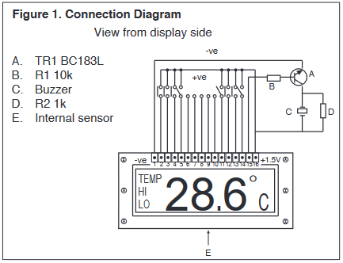
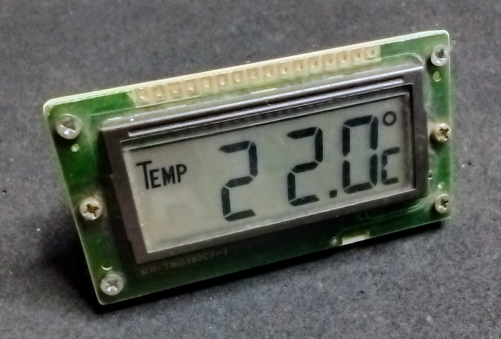
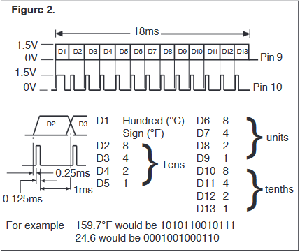
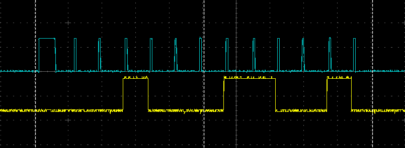
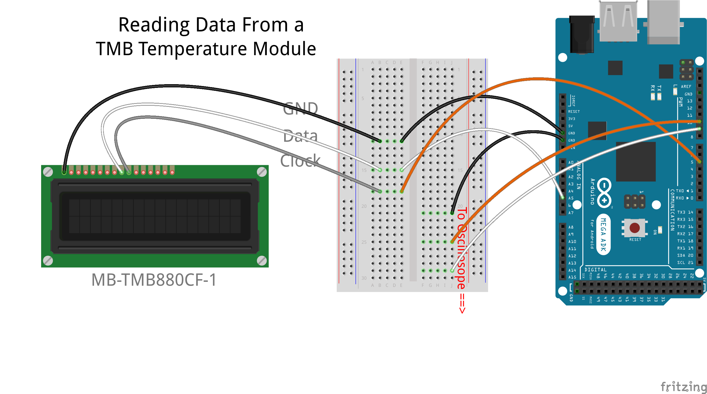
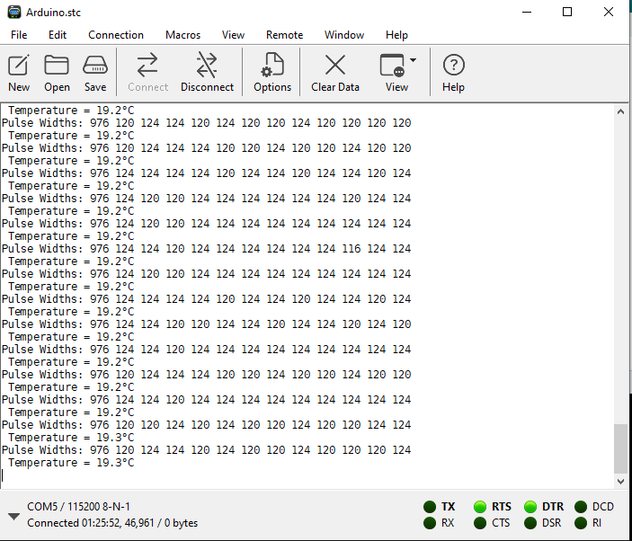
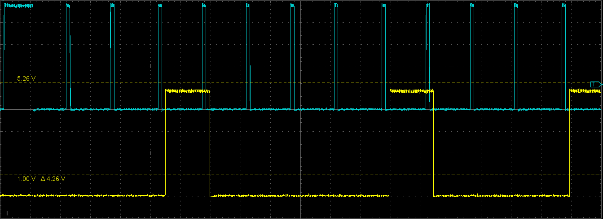

# TMB-DataRead
Reading Serial Data from an MB-TMB880CF-1 Temperature Module with an Arduino Mega R3.

## What is an MB-TMB880CF-1 Module?
The TMB module is a simple and reliable clock & temperature reading module from the late 1980's and early 1990's. It has an on board LCD display, a built in temprature sensor and is powered by a single AA battery. It can be used as a clock and can display the temperature in °C or °F. Additionally, it can be set to alarm on high or low temperature readings. However, all these extra features require connecting buttons and other things to the expansion connector. By default, with nothing connected to the expansion connector, the TMB module displays the temperature in °C, and has no hi/lo triggers set.

 

Everything (including errors) is in the 1988 datasheet that I managed to find: **TMB-DataSheet.pdf**

## What is the Data Output?
By default the TMB module reads the temperature and refreshes the display every 10 seconds. At the same time, it outputs the temperature as a serial stream of BCD data on pin 9, and that is accompanied by a clock pulse stream on pin 10. The serial data is stable and can be read on the falling edge of each clock pulse. Additionally, the first clock pulse is wider than the following pulses, and is used to signify the start of a data stream.

Timing wise, the clock pulses are around 975us (first pulse) and 125us wide. Each data pulse is stable for about 1ms after the falling edge of the clock pulse. I found that the data stream was around 20ms long and was transmitted every 10s or so.

Oh, and the clock/data streams, whilst clearly digital are only a maximum 1.5v p-p, depending upon the condition of the AA battery. I found that they were 1.35v p-p out of my TMB module... not a lot to work with!

_Scope - TMB pins 9 (data, yellow trace) and 10 (clock, blue trace)... 23.2°C (0001000110010)_

## Connecting the TMB Module to an Arduino Mega R3
Only 3 connections into the Mega, clock, data and GND. There are also 3 connections out, but they are just the reconstructed (or level shited) clock, data and gnd for inspection on my oscilloscope - I wanted to see how the pulse timings look compared to the raw pulses from the TMB module.

The Fritzing file for this project is included in this archive: **TMB-DataRead.fzz**

## How I Read the Clock/Data
I needed to detect the clock pulses, rising and faling edges, using that to recognise the start of a data stream and also trigger a data reading on each falling edge. But the clock and the data pulses are tiny, and at maximum are nowhere near the level to be recognised as a "high" in my 5v Mega. I was thinking of level convertors, or using transitors or FETs to allow me to get 0v and 5v levels for the Mega... then my research happened upon comparators (Op-Amps) and the fact that the Mega has one built in!

The analog comparitor in the the Arduino Mega R3 can be given the 1.1v internal reference as an input, and with the clock pulse on the other input, I can recognise highs, lows and edges and trigger hardware interrups from them.

So that was the clock pulses sorted, leaving just the data to be read and "level shifted". I just used an analog input and if the read level was high enough then I know I had a bit that was a 1, else it was a 0.

## The Code
Not a lot to it, but it is all in the INO file: **TMB-Module.ino**

- Some comments including useful web resources I found during my research.
- Include the Analog Comparator library.
- Define some I/O pins.
- Set things up, including setting the alog comp inputs, the interrupt service routine and the serial port.
- In the loop, wait to be told of a clock pulse then read in the data. Do that until all data is read and then print the temperature.
- In the Clock Pulse ISR we get the comparitor level and use that to spot rising and falling edges.
- In the Data Read function we read the ADC level and use that to recognise 0's and 1's. 

# Decoded Temperature Data
_CoolTerm O/P (DejaVu San Mono, UTF8)_

## Reconstructed Clock/Data Pulses
_Scope - Mega pins 9 (data, yellow trace) and 10 (clock, blue trace)... 21.1°C (0001000010001)_

## **_Enjoy!_**
